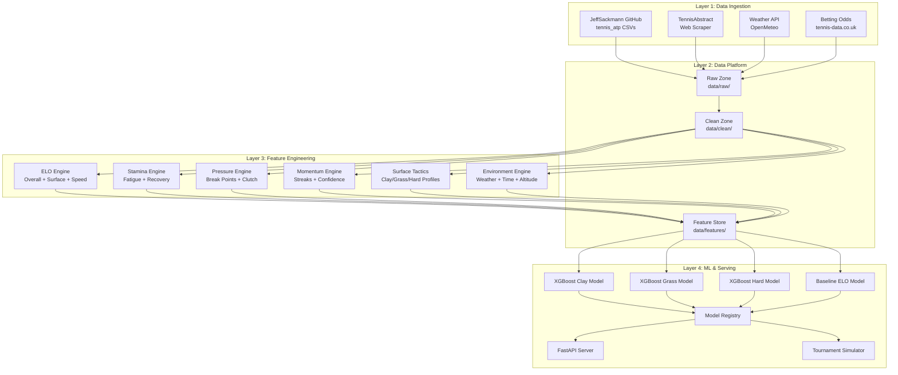
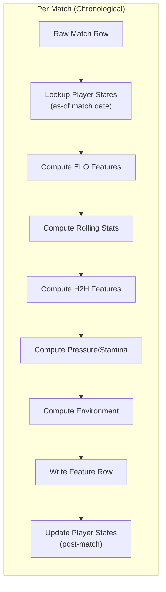

# 🎾 TheOracle — Industry-Grade Tennis Match Prediction System

## Goal
Build a production-quality ML system that predicts ATP tennis match outcomes using surface-aware ELO, stamina/momentum/pressure modeling, environmental context, and XGBoost ensembles. Beat IBM's Wimbledon predictions (~64% accuracy) and target **70-75% realistic accuracy** (75%+ on favorable draws).

> [!IMPORTANT]
> **Realistic accuracy ceiling**: Even bookmaker odds sit at ~72% match-winner accuracy. The theoretical ceiling for pre-match prediction is ~78-80% due to inherent randomness in tennis. Claims of 95%+ are unrealistic without data leakage. Our goal is to **match or beat the bookmakers**.

---

## System Architecture



### Feature Pipeline Flow



> [!WARNING]
> **Leakage Prevention**: Features are computed BEFORE the match. Player states are updated AFTER. This is the #1 mistake Green Code fixed in his second video.

---

## Repository Structure

```
theoracle/
├── configs/
│   ├── data_sources.yaml        # URLs, paths, API keys
│   ├── elo_config.yaml          # K-factor, decay, surface weights
│   ├── model_xgb_clay.yaml     # XGBoost hyperparams per surface
│   ├── model_xgb_grass.yaml
│   ├── model_xgb_hard.yaml
│   └── model_rf_global.yaml
├── data/
│   ├── raw/                     # Downloaded CSVs, scraped HTML
│   ├── clean/                   # Normalized parquet files
│   └── features/                # Feature store output
├── ingestion/
│   ├── __init__.py
│   ├── fetch_sackmann.py        # Download from GitHub
│   ├── scrape_tennis_abstract.py
│   ├── fetch_weather.py         # OpenMeteo API
│   ├── fetch_odds.py            # Betting odds
│   ├── normalize.py             # Schema mapping
│   └── pipeline.py              # Orchestrator
├── features/
│   ├── __init__.py
│   ├── elo_engine.py            # Multi-track ELO system
│   ├── stamina_engine.py        # Fatigue & recovery
│   ├── pressure_engine.py       # Break points, clutch
│   ├── momentum_engine.py       # Streaks, confidence
│   ├── surface_tactics.py       # Surface-specific profiles
│   ├── environment_engine.py    # Weather, time, altitude
│   ├── rolling_stats.py         # Windowed aggregations
│   └── build_features.py        # Main feature builder
├── models/
│   ├── __init__.py
│   ├── datasets.py              # Train/val/test splits
│   ├── baseline_elo.py          # Logistic ELO baseline
│   ├── xgboost_model.py         # XGBoost wrapper
│   ├── random_forest_model.py   # RF wrapper
│   ├── train.py                 # Training CLI
│   ├── evaluate.py              # Metrics & plots
│   └── tournament_sim.py        # Bracket simulator
├── serving/
│   ├── __init__.py
│   ├── api.py                   # FastAPI endpoints
│   └── predictor.py             # Load model + features
├── notebooks/
│   ├── 01_eda.ipynb
│   ├── 02_elo_analysis.ipynb
│   ├── 03_model_comparison.ipynb
│   └── TheOracle_Colab.ipynb    # Self-contained Colab notebook
├── tests/
│   ├── test_elo_engine.py
│   ├── test_leakage.py          # Verify no future data
│   └── test_features.py
├── requirements.txt
├── setup.py
└── README.md
```

---

## Phase 1: Data Ingestion Layer

### [NEW] ingestion/fetch_sackmann.py
- Download all `atp_matches_YYYY.csv` files (1968-2026) from GitHub
- Download `atp_matches_qual_chall_YYYY.csv` for challenger/qualifier data
- Download `atp_players.csv` and `atp_rankings_*.csv`
- Checksum-based change detection for incremental updates
- Store in `data/raw/sackmann/`

### [NEW] ingestion/scrape_tennis_abstract.py
- Scrape recent match data not yet in Sackmann's repo
- Parse match pages for detailed stats (aces, DFs, BPs, serve %)
- Rate limiting (1 req/sec) and retry logic
- Store in `data/raw/tennis_abstract/`

### [NEW] ingestion/fetch_weather.py
- OpenMeteo free API for historical weather at tournament venues
- Map tournament → city → lat/lon coordinates
- Fetch temperature, humidity, wind speed, precipitation
- Store in `data/raw/weather/`

### [NEW] ingestion/normalize.py
- Canonical schema: `match_id, tourney_id, tourney_name, surface, tourney_level, tourney_date, round, player_a_id, player_b_id, winner_id, score, match_stats...`
- Player name resolution via `atp_players.csv`
- Surface normalization: `{Clay, Grass, Hard, Carpet→Hard}`
- Deduplication across sources
- Output: `data/clean/matches.parquet`, `data/clean/players.parquet`

---

## Phase 2: ELO Engine (Core Skill Model)

### [NEW] features/elo_engine.py

**Multi-track ELO system** — maintains 6 parallel ratings per player:

| Track | Description | K-Factor |
|-------|-------------|----------|
| `elo_overall` | All matches | Adaptive |
| `elo_clay` | Clay matches only | Adaptive |
| `elo_grass` | Grass matches only | Adaptive |
| `elo_hard` | Hard/carpet matches | Adaptive |
| `elo_recent` | Last 30 matches (all surfaces) | Fixed 32 |
| `elo_recent_surface` | Last 15 matches on surface | Fixed 32 |

**Adaptive K-Factor** (from chess, as Green Code implemented in video 2):
```python
K = 250 / ((matches_played + 5) ** 0.4)
# Plus inactivity boost:
if days_since_last_match > 60:
    K *= 1.0 + min((days_since_last_match - 60) / 365, 1.0)
```

**Surface Adaptability Features** derived from ELO:
- `elo_surface_delta = elo_surface[S] - elo_overall` (how much better/worse on this surface)
- `surface_specialist_index = stdev(elo_clay, elo_grass, elo_hard)` (high = specialist)
- `surface_match_fraction` = fraction of last 50 matches on this surface

---

## Phase 3: Advanced Feature Modules

### [NEW] features/stamina_engine.py
Computes fatigue and recovery indicators:

| Feature | Source | Description |
|---------|--------|-------------|
| `days_since_last_match` | match dates | Recovery time |
| `matches_last_7_days` | match dates | Tournament density |
| `matches_last_14_days` | match dates | Extended fatigue |
| `sets_played_last_3_matches` | scores | Recent workload |
| `five_set_matches_last_30d` | scores | Grueling match count |
| `avg_match_duration_recent` | match time | Energy expenditure |
| `fatigue_index` | composite | Weighted workload score |
| `recovery_quality` | composite | Rest days × age factor |

### [NEW] features/pressure_engine.py
Mental toughness indicators:

| Feature | Source | Description |
|---------|--------|-------------|
| `bp_saved_rate_career` | match stats | Career break points saved % |
| `bp_saved_rate_surface` | match stats | Surface-specific BP saved % |
| `bp_conversion_rate` | match stats | Break point conversion % |
| `tiebreak_win_rate` | scores | Tiebreak W/L ratio |
| `deciding_set_win_rate` | scores | 3rd/5th set performance |
| `comeback_rate` | scores | Win after losing set 1 |
| `pressure_resilience_idx` | composite | Weighted clutch score |

### [NEW] features/momentum_engine.py
Form and confidence tracking:

| Feature | Source | Description |
|---------|--------|-------------|
| `win_streak` | results | Current consecutive wins |
| `loss_streak` | results | Current consecutive losses |
| `form_last_10` | results | Win % in last 10 matches |
| `form_last_10_surface` | results | Surface-specific form |
| `elo_trend_30d` | ELO history | ELO slope over 30 days |
| `avg_opponent_elo_last_5` | ELO | Quality of recent competition |
| `tournament_momentum` | results | Wins in current tournament so far |
| `confidence_index` | composite | EWMA of recent performances |

### [NEW] features/surface_tactics.py
Surface-specific game style profiles:

| Feature | Source | Surface Focus |
|---------|--------|---------------|
| `ace_rate_on_surface` | stats | Grass (serve power) |
| `df_rate_on_surface` | stats | All (serve reliability) |
| `first_serve_pct_surface` | stats | Grass (first-strike) |
| `first_serve_won_pct_surface` | stats | Grass (serve effectiveness) |
| `second_serve_won_pct_surface` | stats | Clay (grind ability) |
| `return_points_won_surface` | stats | Clay (return game) |
| `bp_faced_per_game_surface` | stats | All (hold strength) |
| `service_dominance_index` | composite | Serve vs return balance |
| `clay_grind_index` | composite | Return + rally ability on clay |
| `grass_serve_index` | composite | Serve + net ability on grass |

### [NEW] features/environment_engine.py
Match context features:

| Feature | Source | Description |
|---------|--------|-------------|
| `temperature_c` | weather API | Match-day temperature |
| `humidity_pct` | weather API | Humidity percentage |
| `wind_speed_kmh` | weather API | Wind speed |
| `is_indoor` | tournament data | Indoor flag |
| `altitude_m` | tournament data | Venue altitude |
| `tourney_level_encoded` | tournament data | GS=4, M1000=3, 500=2, 250=1 |
| `round_encoded` | match data | F=7, SF=6, QF=5, R16=4... |
| `best_of` | match data | Best of 3 or 5 |
| `home_advantage` | player/tourney | Player country == tourney country |

---

## Phase 4: Model Training

### [NEW] models/datasets.py
- **Temporal split** (no random shuffling!):
  - Train: 2000–2023
  - Validation: 2024
  - Test: 2025+ (held-out tournaments)
- Feature matrix construction from feature store
- Handling missing values (median imputation for stats, flag columns)

### [NEW] models/xgboost_model.py
- Per-surface model training (3 separate XGBoost models)
- Config-driven hyperparameters from YAML
- SHAP explainability integration
- Probability calibration check

**Default XGBoost config**:
```yaml
# model_xgb_clay.yaml
n_estimators: 500
max_depth: 6
learning_rate: 0.05
subsample: 0.8
colsample_bytree: 0.8
reg_lambda: 1.0
reg_alpha: 0.1
min_child_weight: 3
eval_metric: logloss
early_stopping_rounds: 50
```

### [NEW] models/evaluate.py
- Accuracy, Log Loss, Brier Score, ROC-AUC
- Per-surface accuracy breakdown
- Per-tournament-level accuracy
- Calibration plots
- Feature importance (SHAP)
- Comparison vs ELO baseline and betting odds

### [NEW] models/tournament_sim.py
- Input: tournament draw + surface + current player states
- Monte Carlo simulation (1000 runs)
- Output: win probabilities for each player reaching each round
- Bracket visualization

---

## Phase 5: Serving Layer

### [NEW] serving/api.py
FastAPI endpoints:
- `POST /predict` — predict match winner with probabilities
- `POST /simulate` — simulate tournament bracket
- `GET /player/{id}/profile` — player ELO history + surface profile
- `GET /health` — service health check

### [NEW] serving/predictor.py
- Load latest model artifacts from `models/artifacts/`
- Compute features on-the-fly for upcoming matches
- Return prediction + top-5 feature importances

---

## Phase 6: Evaluation & Testing

### [NEW] tests/test_leakage.py
- Verify every feature timestamp < match date
- Verify ELO used is pre-match, not post-match
- Verify no future H2H data leaks

### Metrics Targets

| Metric | Baseline (ELO only) | Target (Full Model) | Bookmakers |
|--------|---------------------|---------------------|------------|
| Match Accuracy | ~66% | 70-75% | ~72% |
| Log Loss | ~0.62 | <0.58 | ~0.55 |
| ROC-AUC | ~0.72 | >0.76 | ~0.78 |

---

## Phase 7: Google Colab Notebook

### [NEW] notebooks/TheOracle_Colab.ipynb
Self-contained notebook that runs the entire pipeline:

```
Step 1: Install dependencies
Step 2: Clone repo + download data
Step 3: Run ingestion pipeline
Step 4: Build feature store
Step 5: Train models (with GPU if available)
Step 6: Evaluate + visualize
Step 7: Predict upcoming tournament
```

---

## Google Colab Step-by-Step Instructions

### Prerequisites
- Google account with access to Google Colab
- ~2GB free Google Drive space

### Steps

**1. Open Colab & Set GPU Runtime**
```
Go to: https://colab.research.google.com
Menu → Runtime → Change runtime type → T4 GPU → Save
```

**2. Install Dependencies**
```python
!pip install -q xgboost lightgbm scikit-learn pandas numpy matplotlib seaborn shap fastapi uvicorn pyyaml requests beautifulsoup4 pyarrow tqdm
```

**3. Clone Repository**
```python
!git clone https://github.com/YOUR_USERNAME/theoracle.git
%cd theoracle
```

**4. Download Data**
```python
from ingestion.pipeline import run_full_ingestion
run_full_ingestion()  # Downloads ~200MB of CSVs
```

**5. Build Features**
```python
from features.build_features import build_feature_store
build_feature_store()  # Takes ~5-10 min
```

**6. Train Models**
```python
from models.train import train_all_models
results = train_all_models(gpu=True)
print(results)
```

**7. Evaluate**
```python
from models.evaluate import full_evaluation
full_evaluation(plot=True)
```

**8. Predict a Tournament**
```python
from models.tournament_sim import simulate_tournament
simulate_tournament("Wimbledon 2026", n_simulations=1000)
```

---

## Verification Plan

### Automated Tests
```bash
python -m pytest tests/ -v
python -m pytest tests/test_leakage.py -v  # Critical!
```

### Model Validation
- Train on 2000-2023, validate on 2024, test on 2025
- Compare accuracy vs ELO-only baseline
- Compare vs historical betting odds accuracy
- Per-surface accuracy breakdown

### Manual Verification
- Predict a recent completed tournament and compare to actual results
- Verify feature importances make tennis sense (ELO diff should be #1)
- Check calibration: when model says 70%, does the favorite win ~70% of the time?

---

## Open Questions

> [!IMPORTANT]
> 1. **Local vs Colab**: Do you want to primarily develop locally (Windows) or in Google Colab? The repo supports both, but Colab is easier for GPU training.
> 2. **WTA Data**: Should we include women's tennis (WTA) data too, or ATP only?
> 3. **Live Predictions**: Do you want the FastAPI server for live predictions, or is the notebook/CLI sufficient for now?
> 4. **Betting Odds Integration**: Should we scrape/incorporate historical betting odds as features (they're very predictive)?

---

## Implementation Order

| Phase | Description | Est. Time |
|-------|-------------|-----------|
| 1 | Data Ingestion (fetch + normalize) | First |
| 2 | ELO Engine (multi-track + adaptive K) | Second |
| 3 | Feature Engineering (all 6 modules) | Third |
| 4 | Model Training (XGBoost per-surface) | Fourth |
| 5 | Evaluation & Tournament Simulation | Fifth |
| 6 | Serving Layer (FastAPI) | Sixth |
| 7 | Colab Notebook (self-contained) | Last |
